<h1 align="center">🍽️ Recipe Finder</h1>

<p align="center">
  A full-featured recipe discovery app built with Flutter & Supabase
</p>

<div align="center">
  
  
  
</div>

---

## 🎥 About the App

Recipe Finder is a modern recipe discovery app that lets you browse meals by category, save your favorites, and enjoy a smooth cooking experience with full Dark/Light mode and Arabic/English localization support.

**Key Features:**
- 🔍 **Search** recipes and ingredients
- ❤️ **Favorites** — save and manage your favorite meals
- 🍖 **Browse by Category** — Beef, Chicken, Seafood, Dessert, Vegetarian, Pasta
- 📋 **Meal Details** — ingredients, instructions, cooking time & calories
- 🌓 **Dark & Light Theme** support
- 🌍 **Localization** — Arabic & English with full RTL support
- 🔐 **Authentication** — Email/Password, Google & Facebook Sign In
- ☁️ **Supabase** — backend, database & auth

---

## 📱 App Screens

### Light Mode

<table>
<tr>
  <td align="center">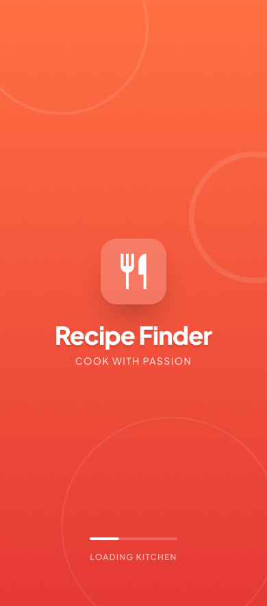<br/>Splash</td>
  <td align="center">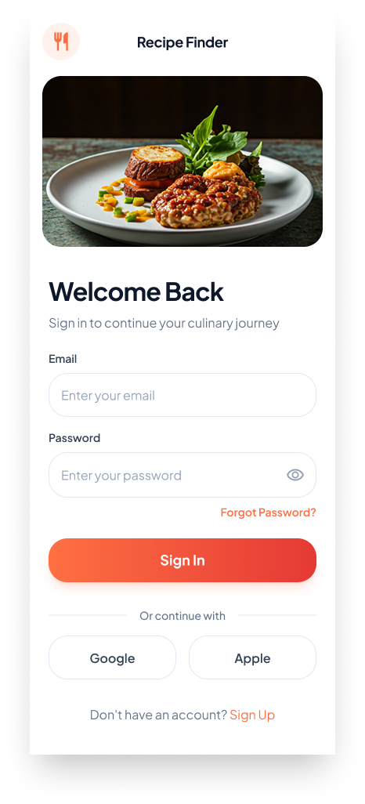<br/>Sign In</td>
  <td align="center">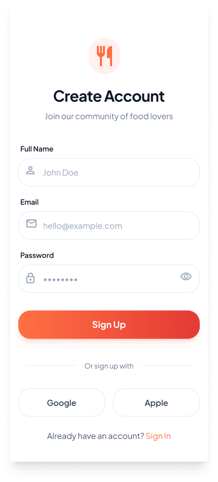<br/>Sign Up</td>
  <td align="center"><br/>Home</td>
</tr>
<tr>
  <td align="center">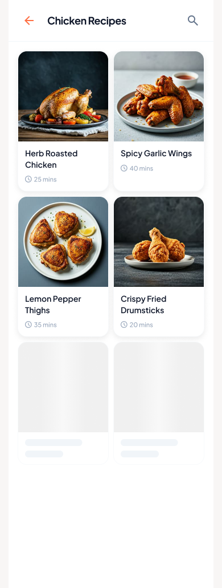<br/>Meals by Category</td>
  <td align="center">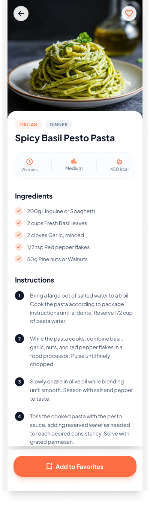<br/>Meal Details</td>
  <td align="center">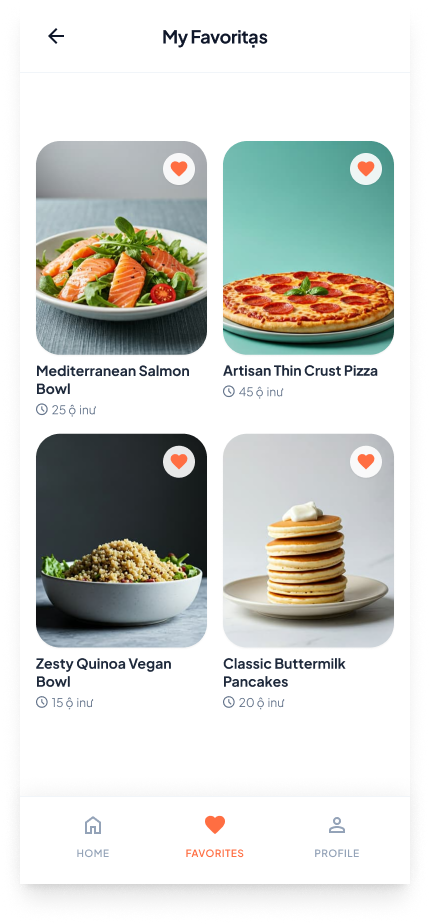<br/>Favorites</td>
  <td align="center">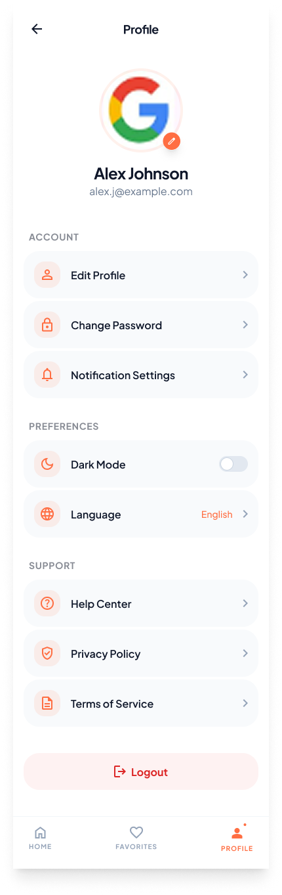<br/>Profile</td>
</tr>
</table>

### Dark Mode

<table>
<tr>
  <td align="center">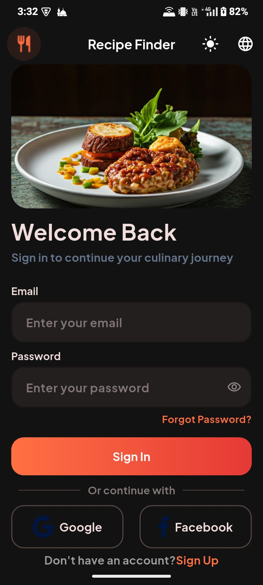<br/>Sign In — Dark</td>
  <td align="center">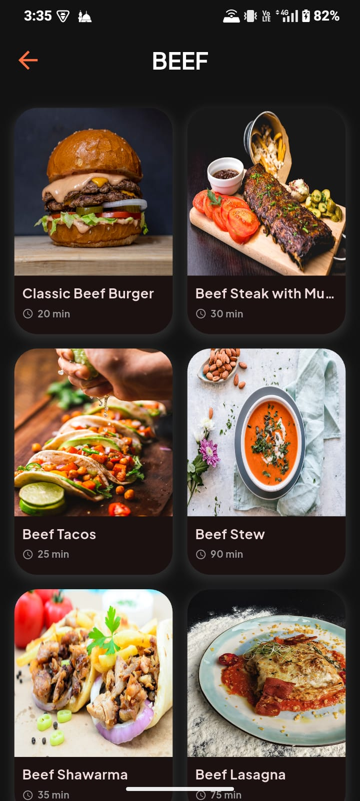<br/>Meals — Dark</td>
  <td align="center">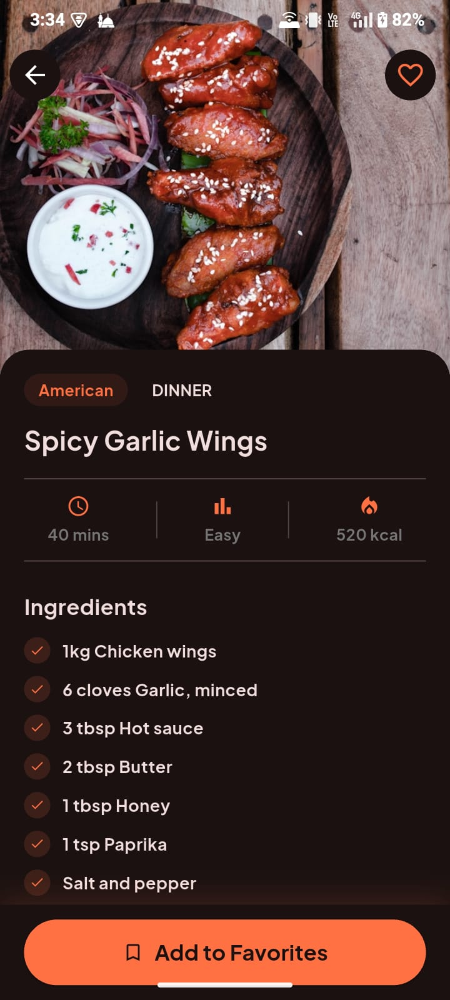<br/>Meal Details — Dark</td>
  <td align="center">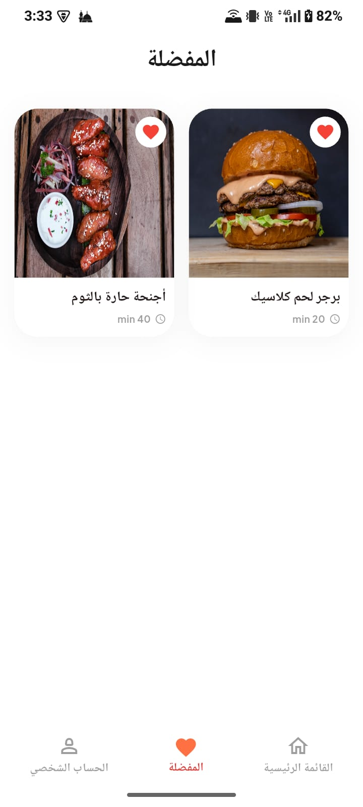<br/>Favorites — Light</td>
</tr>
</table>

### Arabic (RTL) Support

<table>
<tr>
  <td align="center">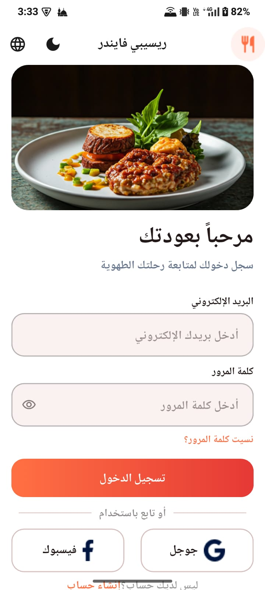<br/>Sign In — AR</td>
  <td align="center">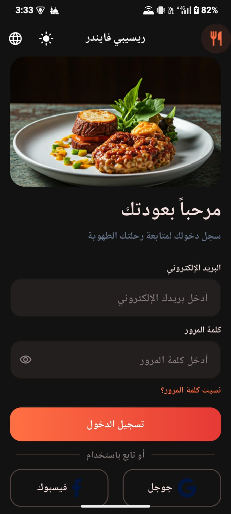<br/>Sign In — AR Dark</td>
  <td align="center">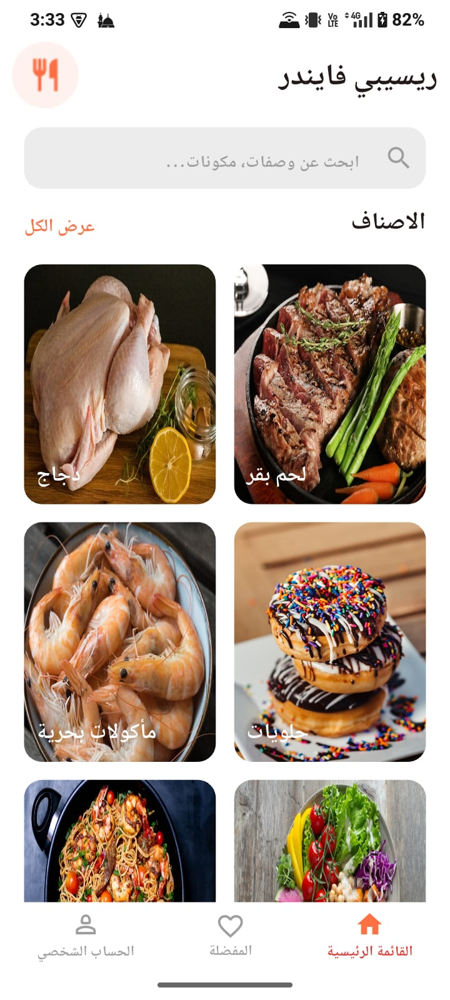<br/>Home — AR</td>
  <td align="center">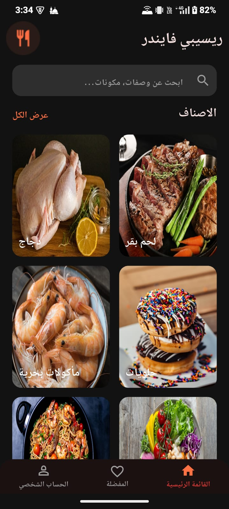<br/>Home — AR Dark</td>
</tr>
<tr>
  <td align="center"><br/>Profile — AR</td>
  <td align="center">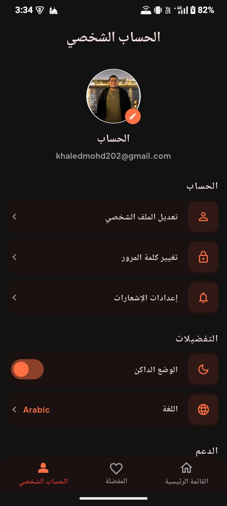<br/>Profile — AR Dark</td>
  <td align="center">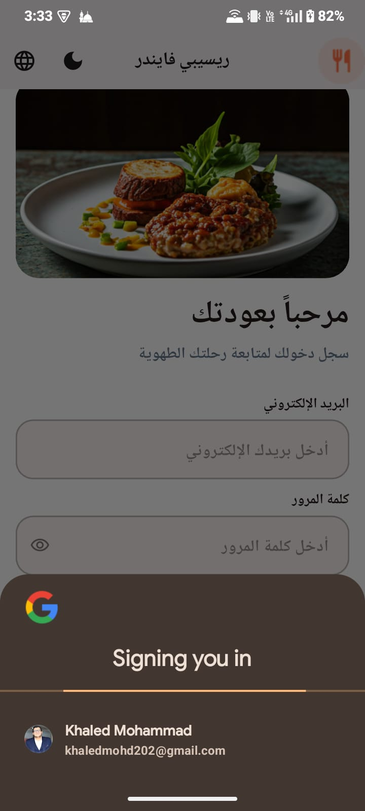<br/>Google Sign In</td>
</tr>
</table>

---

## 🛠️ Tech Stack

| Category | Technologies |
| :--- | :--- |
| **Core & Architecture** | Flutter, Dart, Clean Architecture, BLoC/Cubit |
| **State Management** | flutter_bloc |
| **Backend & Auth** | Supabase (Database, Auth, Storage) |
| **Social Auth** | Google Sign In, Facebook Auth |
| **Dependency Injection** | GetIt |
| **Local Storage** | Shared Preferences |
| **Localization** | Custom AppLocalizations (AR & EN) |
| **UI** | flutter_screenutil, cached_network_image, dartz |

---

## 🏗️ Project Architecture

```
lib/
├── core/
│   ├── app/               # Theme & Localization Cubits
│   ├── common/            # Shared widgets
│   ├── di/                # Dependency injection
│   ├── extension/         # Context, String, Num extensions
│   ├── languages/         # AppLocalizations setup
│   ├── routing/           # AppRoutes & AnimationRouting
│   └── style/             # Colors, Theme, Icons
│
└── features/
    ├── auth/              # Email, Google, Facebook auth
    ├── home/              # Categories grid
    ├── meals/             # Meals list with pagination
    ├── meal_details/      # Ingredients, instructions, stats
    ├── favorites/         # Save & manage favorites
    ├── profile/           # Theme toggle, language, logout
    ├── main/              # Bottom navigation
    └── splash/            # Splash screen
```

---

## 🚀 How to Run

### 1️⃣ Clone the Repository
```bash
git clone https://github.com/khaledmohd202/recipe_finder.git
```

### 2️⃣ Install Dependencies
```bash
flutter pub get
```

### 3️⃣ Setup Environment
Create a `.env` file in the root:
```
SUPABASE_URL=your_supabase_url
SUPABASE_ANON_KEY=your_anon_key
```

### 4️⃣ Run the App
```bash
flutter run
```

---

## 👨‍💻 Developer

**Khaled Mohammad** — Flutter Developer based in Jeddah, Saudi Arabia 🇸🇦

<div>
  <a href="https://www.linkedin.com/in/khaled-m-b02494218">
    
  </a>
  <a href="mailto:khaledmohd202@gmail.com">
    
  </a>
  <a href="https://wa.me/201060040675">
    
  </a>
</div>